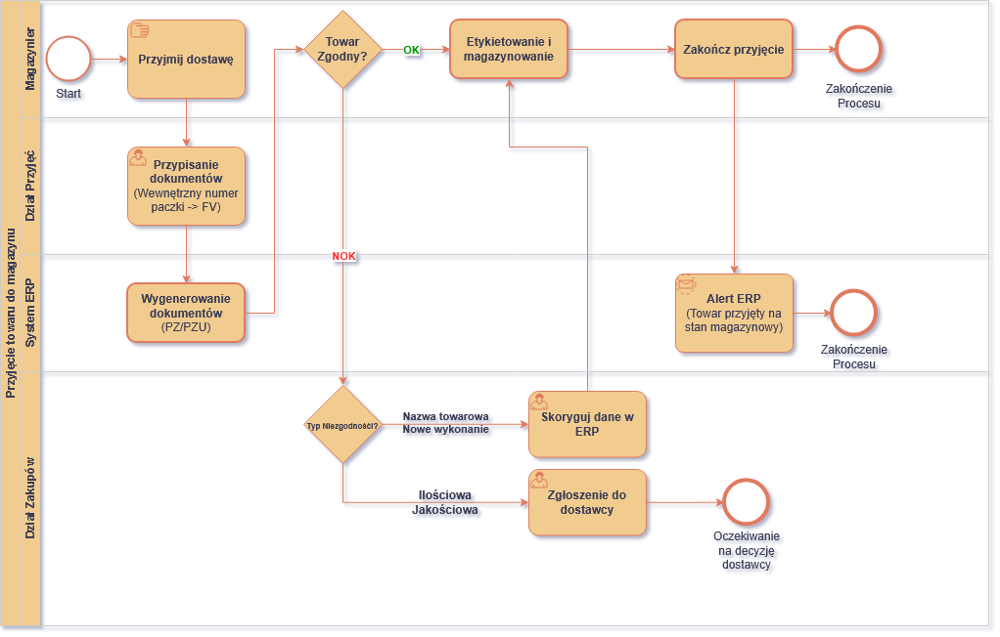
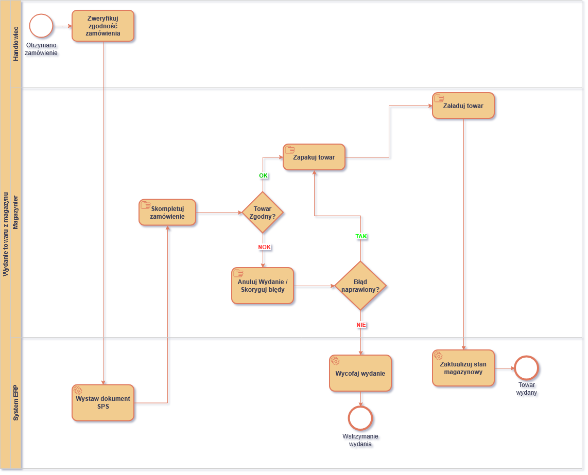
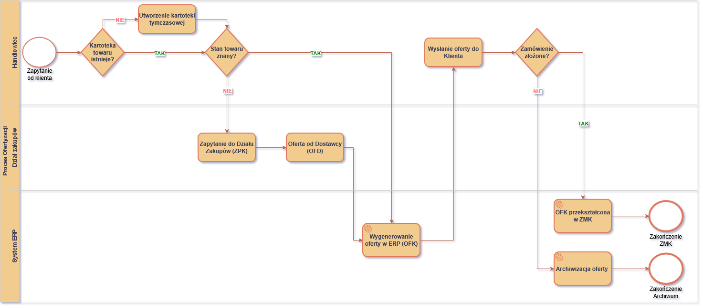

# BPMNProcess
Mapowanie procesów biznesowych i logistycznych w systemie ERP

---

## 1. Przyjęcie towaru na magazyn i obsługa niezgodności

**O procesie:**  
Diagram przedstawia ścieżkę od momentu fizycznego przyjścia dostawy, przez weryfikację dokumentów i nadanie wewnętrznych numerów paczek, aż po przyjęciu i informacje przez system ERP. 

**Co zostało uwzględnione:**
* Obsługę ścieżki wyjątków (błędy NOK): podział na rozbieżności w nazewnictwie/wykonaniu towaru (korekta kartoteki w ERP przez Dział Kartotek/Zakupów) oraz braki ilościowe/jakościowe (reklamacja do dostawcy).
* Automatyzację systemową: generowanie dokumentów PZ/PZU oraz automatyczne alerty e-mail po zamknięciu przyjęcia przez magazyniera (Informacja dla handlowca że towar jest na stanie i można wysyłać do klienta)

---

## 2. Wydanie towaru z magazynu

**O procesie:**  
Proces realizowany od momentu weryfikacji zamówienia przez handlowca, przez etap kompletacji, pakowanie, aż po fizyczny załadunek i wyjazd towaru do klienta.

**Co tutaj uwzględniłem:**
* Podział na zadania manualne (magazynier) i automatyczne akcje systemowe (Service Tasks w torze ERP).
* Kontrolę jakościową na magazynie: weryfikacja zgodności towaru z dokumentem SPS.
* Obsługę błędów przy kompletacji: scenariusz szybkiej naprawy pomyłki przez pracownika lub błąd skutkujący systemowym wycofaniem wydania i zamrożeniem procesu w ERP na czas wyjaśnienia.

---

## 3. Proces ofertyzacji

**O procesie:**  
Diagram BPMN przedstawia proces przygotowania oferty przez handlowca dla klienta B2B od momentu zapytania (mail/telefon) do finalizacji - Zamówienie klienta (ZMK) lub przekazaniu do archiwum po przedawnieniu.

**Co tutaj uwzględniłem:**
* Dwa niezależne warunki: istnienie kartoteki towarowej i znajomość stanu magazynowego — brak kartoteki oznacza automatycznie brak stanu magazynowego.
* Ścieżkę przyspieszoną (towar na stanie -> oferta od razu) oraz pełną (ZPK -> OFD -> OFK, z tworzeniem kartoteki tymczasowej dla nowego towaru).
* Dwa zakończenia procesu: zamówienie klienta (ZMK) albo archiwizacja po przedawnieniu oferty.
* Proces ofertowania B2B, współpraca z działem zakupów.

---

## Tech Stack & Kompetencje
* **Narzędzia:** Draw.io
* **Notacja:** Elementy BPMN 2.0 (z zachowaniem ról/torów, bramek decyzyjnych a także z rozróżnieniem zadań ludzkich a także systemowych)
* **Znajomość domenowa:** Logistyka magazynowa (WMS), zarządzanie zapasami, proces O2C, obsługa reklamacji i dokumentów korygujących
- **Pliki źródłowe (.drawio):** dostępne w folderze [`/assets/BPMNSource`](https://github.com/ZakAlbert0000/BPMNProcess/tree/main/assets/bpmn-source)
